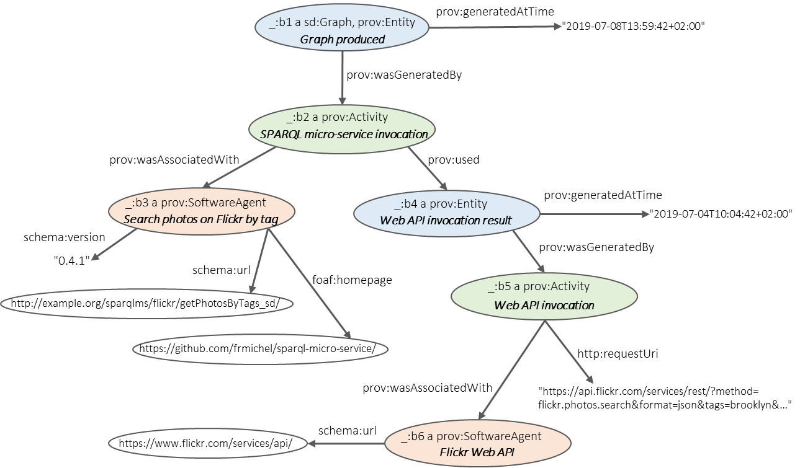

# Generation of  Provenance Information

When a SPARQL micro-service is invoked, it generates a small, resource-centric graph delineated by the Web API service being wrapped, the arguments passed to the service, and the types of RDF triples that the SPARQL micro-service is designed to spawn.

Optionally, **provenance information** can be added to the graph. This is configured on a micro-service--basis with parameter ```add_provenance = true```in the config.ini file, or with triple ```<> sms:addProvenance "true"^^xsd:boolean;``` in the service description graph (see the [configuration page](02-config.md)).

Two SPARQL queries are used to generate the provenance information:
- [add_provenance.sparql](../src/sparqlms/resources/add_provenance.sparql) applies to micro-services configured using the [service description method](../doc/02-config.md#configuration-with-a-sparql-service-description-file)
- [add_provenance_simple.sparql](../src/sparqlms/resources/add_provenance_simple.sparql) applies to micro-services configured using the [config.ini method](../doc/02-config.md#configuration-with-file-configini), and generates more simple provenance information (because some information, such as the Web API name and URL, are only provided in the service description method).

## Provenance information model 

The provenance information is modelled according to the [Provenance Ontology](https://www.w3.org/TR/prov-o/) (PROV-O) as described below.



- The top blank node (```_:b1```) is an [Entity](https://www.w3.org/TR/prov-o/#Entity) representing the graph produced. It was [generated at](https://www.w3.org/TR/prov-o/#generatedAtTime) a certain date and time, and [generated by](https://www.w3.org/TR/prov-o/#wasGeneratedBy) an [Activity](https://www.w3.org/TR/prov-o/#Activity) (```_:b2```) denoting the invocation of the SPARQL micro-service.
- The SPARQL micro-service invocation (```_:b2```) [was associated with](https://www.w3.org/TR/prov-o/#wasAssociatedWith) a [SoftwareAgent](https://www.w3.org/TR/prov-o/#SoftwareAgent) (```_:b3```) that is the SPARQL micro-service itself, i.e. the micro-service was responsible for executing the invocation activity. Plus, the SPARQL micro-service invocation (```_:b2```) [used](https://www.w3.org/TR/prov-o/#used) as an input an [Entity](https://www.w3.org/TR/prov-o/#Entity) (```_:b4```) denoting the result of the Web API invocation.
- The Web API invocation result (```_:b4```) was [generated at](https://www.w3.org/TR/prov-o/#generatedAtTime) a certain date and time, and [generated by](https://www.w3.org/TR/prov-o/#wasGeneratedBy) an [Activity](https://www.w3.org/TR/prov-o/#Activity) (```_:b5```) denoting the Web API invocation.
- The API invocation (```_:b5```) [was associated with](https://www.w3.org/TR/prov-o/#wasAssociatedWith) a [SoftwareAgent](https://www.w3.org/TR/prov-o/#SoftwareAgent) (```_:b6```) that is the Web API, and was invoked by means of an [HTTP request URI](https://www.w3.org/TR/HTTP-in-RDF10/#requestURIProperty).

##### Date and time

Note that the graph (```_:b1```) and the Web API invocation result (```_:b4```) may have been generated at different dates and times. This happens when a cache database is used: the Web API invocation result was generated at the date and time at which the cached document was fetched from the WebAPI. Whereas the graph was generated at the date and time the SPARQL micro-service was invoked. Hence, the Web API invocation may be older than the SPARQL micro-service invocation.
